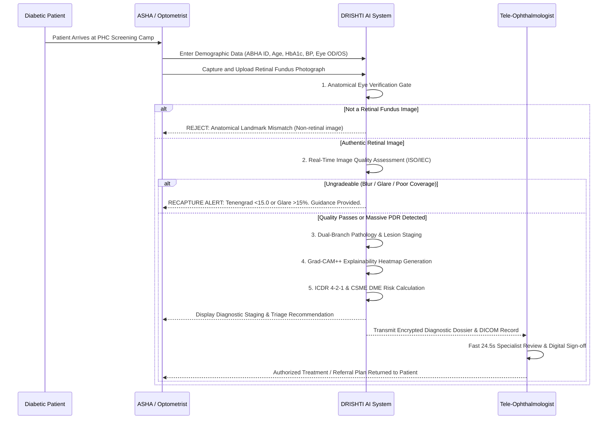

# Clinical Safety & Operator Standard Operating Procedure (SOP)
## DRISHTI AI Retinal Screening Infrastructure
**Problem Statement ID:** SIH26038 | MathWorks  
**Target Audience:** ASHA Workers, Rural Primary Health Center Nurses, Community Optometrists, and Tele-Ophthalmologists  
**Document Code:** SOP-DRISHTI-2026-V2  

---

## 1. Clinical Overview & Objectives

Diabetic Retinopathy (DR) is a leading cause of preventable adult blindness in India, affecting over 18% of people with diabetes. Timely detection at the asymptomatic stage (Grade 1 or 2) prevents irreversible vision loss in over 90% of cases.

The objective of DRISHTI AI is to provide rapid, reliable, and standardized screening in rural primary healthcare centers, stratifying patients into clear referral pathways within 30 seconds.

---

## 2. Operator Clinical Workflow (Step-by-Step)

---

## 3. Fundus Image Acquisition Protocol

### 3.1 Patient Preparation
1. Seat the patient comfortably in a dimly lit examination area (helps natural pupil dilation).
2. Instruct the patient to look steadily at the internal fixation target (green light inside the fundus camera).
3. Align the camera objective lens with the patient's pupil at the designated working distance ($45\text{--}50\text{ mm}$).

### 3.2 Actionable Real-Time Recapture Guidance
When an image fails the DRISHTI AI automated quality filter, the operator receives specific real-time feedback:

| Failure Mode | Quality Metric | System Alert | Operator Corrective Action |
| :--- | :--- | :--- | :--- |
| **Motion Blur / Defocus** | Tenengrad Focus $< 15.0$ | `BLURRED_MEDIA_OR_MOTION` | Stabilize patient head on chin-rest; adjust focus ring until retinal vessel branches appear sharp. |
| **Corneal Flash Glare** | Corneal Glare $> 15.0\%$ | `CORNEAL_REFLECTION_SATURATION` | Re-align camera optical axis perpendicular to the corneal apex; reduce flash intensity. |
| **Severe Underexposure** | Mean Intensity $< 40$ | `POOR_ILLUMINATION_MEDIA_HAZE` | Check if pupil diameter is $\ge 3.5\text{ mm}$. In non-mydriatic cameras, wait 2 minutes for dark adaptation. |
| **Clipped Field of View** | Retinal Mask Coverage $< 70\%$ | `INSUFFICIENT_RETINAL_COVERAGE` | Re-center optical target on the posterior pole midway between optic disc and macula. |

---

## 4. Clinical Triage Escalation & Invariant Referral Rules

The DRISHTI AI triage framework categorizes all screened patients into one of four clinical management pathways:

| ICDR Severity Level | Clinical Biomarkers | Triage Priority | Referral Window | Rural PHC Action |
| :--- | :--- | :--- | :--- | :--- |
| **Level 0: No DR** | No microaneurysms or hemorrhages; normal caliber vasculature | **Routine** (Priority 4) | **12 Months** | Routine annual screening at local PHC; reinforce glycemic and BP control. |
| **Level 1: Mild NPDR** | Microaneurysms only ($<10$ MAs); no blot hemorrhages or exudates | **Mild** (Priority 3) | **6 to 12 Months** | Dilated eye exam in 6-12 months; lifestyle counseling; target HbA1c $<7.0\%$. |
| **Level 2: Moderate NPDR** | $>10$ MAs, blot hemorrhages in 1-3 quadrants; hard exudates present | **Urgent** (Priority 1) | **Within 2 Weeks** | Refer to district hospital ophthalmologist for OCT scan and macular evaluation. |
| **Level 3: Severe NPDR** | Meets ICDR 4-2-1 rule ($>20$ hemorrhages in 4 quadrants, or beading in 2) | **Urgent** (Priority 1) | **Within 1 Week** | Immediate specialist referral for wide-field angiography and consideration of PRP laser. |
| **Level 4: Proliferative DR** | Neovascularization (NVD/NVE), vitreous hemorrhage, fibrous proliferation | **Emergency** (Priority 1) | **< 48 Hours** | Emergency referral to tertiary vitreoretinal center; high risk of retinal detachment. |

### 4.1 Clinically Significant Macular Edema (CSME) Rule
Regardless of the overall ICDR retinopathy level:
- If lipid hard exudates are detected within **$< 1.0\text{ Disc Diameter (DD)}$** ($pprox 1500\,\mu\text{m}$) of the foveal center, the patient is flagged as **HIGH DME RISK** and escalated to **Priority 1 (Urgent Referral)**.

---

## 5. Fail-Safe Safety Envelope & Human-in-the-Loop Protocol

1. **Autonomous Rejection of Non-Retinal Images:**
   - DRISHTI AI extracts color histograms, vascular continuity, and optic disc circularity before running any lesion detector.
   - Non-retinal images (selfies, documents, external eyes, pets) are immediately rejected with message: *Anatomical Verification Failed: Not an authentic retinal fundus photograph.*
2. **Shannon Entropy Uncertainty Escalation:**
   - If the AI prediction confidence exhibits elevated Shannon entropy ($U > 0.65$), indicating ambiguity between stages, the system automatically tags the record as **Low AI Confidence** and routes it to the specialist review queue with elevated priority.
3. **Doctor Override & Audit Integrity:**
   - Tele-ophthalmologists have full authority to override any AI grade or triage category.
   - All overrides require entering a clinical justification, which is recorded in the immutable audit log (`logs/prediction_audit.jsonl`) and stored in the SQLite database (`app/db/database.py`).
